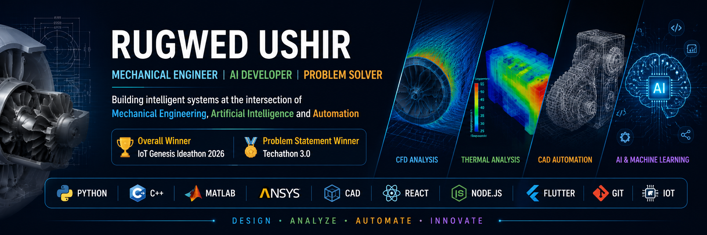

  

  

## 👋 Hi, I'm Rugwed Ushir

I'm a Mechanical Engineering student at VIT Pune passionate about integrating Artificial Intelligence with Mechanical Engineering. My projects span CAD/CAM automation, CFD and thermal analysis, IoT systems, and AI-powered engineering tools, with a focus on developing intelligent solutions that bridge design, simulation, and automation.

🏆 Overall Winner – IoT Genesis Ideathon 2026  
🏆 Problem Statement Winner – Techathon 3.0

## Connect With Me

- LinkedIn
- Email
- GitHub

## ⚒️ Technologies & Tools

## 🚀 Featured Projects

## 📊 GitHub Analytics

  

  

  

## Achievements
🏆 IoT Genesis Ideathon 2026 – Overall Winner.
🏆 Techathon 3.0 – Problem Statement Winner.
🥇 CodeNova Innovation Challenge.
🥈 AI Cloudverse Innovation Challenge.
